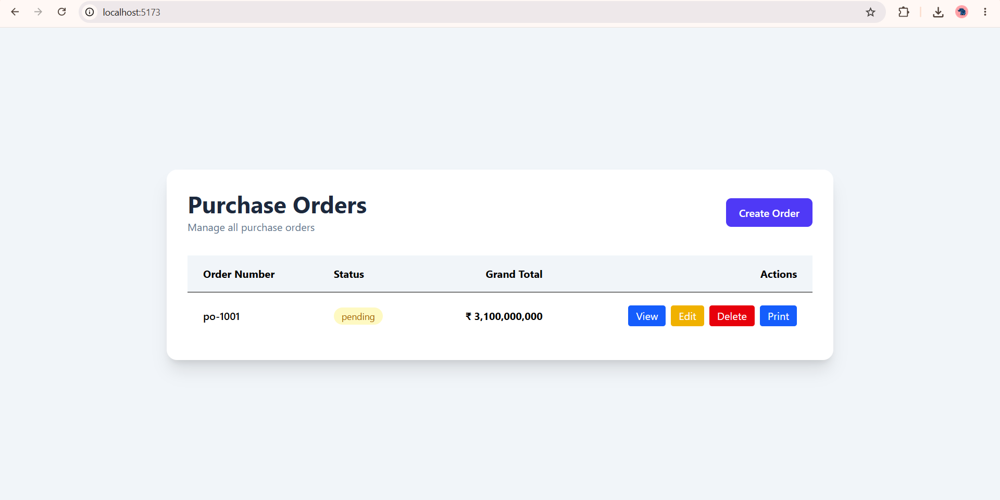

# Purchase Order Management System

A web-based application for managing the complete purchase order lifecycle, from request creation to approval and tracking. The system helps organizations maintain accurate records, and improve visibility into purchasing activities.

## Features
- Create, edit, and delete purchase orders
- Supplier and product management

## Technology Stack
- Frontend: React
- Backend: Python
- Database: Sqlite

## Installation
1. Clone this repository.
2. Install the required dependencies.
3. Configure the environment variables.
4. Start the application.

## Screenshots

### Dashboard

### Purchase Order Form

## Future Enhancements
- Email and in-app notifications
- PDF and Excel export
- Role-based access control

## License
This project is provided for educational and demonstration purposes.
